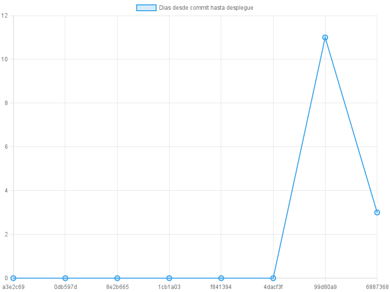

# Análisis metricas DORA en tensorflow (2023)

## Deployment Frecuency

Tensorflow tuvo 8 despliegues estables durante el 2023, esto implica que el equipo de desarrollo tuvo un nivel bajo de despliegues a produccion. Esto se puede resolver haciendo despliegues mas pequeños, esto permite hacer mas sencillo el testeo, despliegue y la solucion de errores, ya que es mas sencillo encontrar estos en puntos pequeños de codigo.

## Lead Time For Changes

En 2023 el equipo de Tensorflow se tardo en promedio 1.75 dias en resolver errores y enviarlos a produccion, esto implica que el equipo tuvo un alto nivel de adaptacion a estos.

El siguiente grafico de curva muestra como fue la velocidad de despliegue del equipo en cuanto a dias.

## Change Failure Rate 

El porcentaje de despliegues con fallos de Tensorflow en el 2023 fue de un 52.94%, lo que dice que la mitad de los despliegues del equipo venian con fallos. Esto dice que el equipo tuvo un rendimiento bajo en cuanto a despliegues exitosos.

## Mean Time to Recovery

En promedio el equipo de desarrollo de Tensorflow en 2023 se tardo 26.89 dias en recuperarse de los errores, esto mostro que el equipo tiene una baja capacidad para recuperarse de los errores, esto posiblemente por su bajo nivel de frecuencia de despliegues, esto porque al ser despliegues mas grandes es mas complejo encontrar las fuentes de errores.