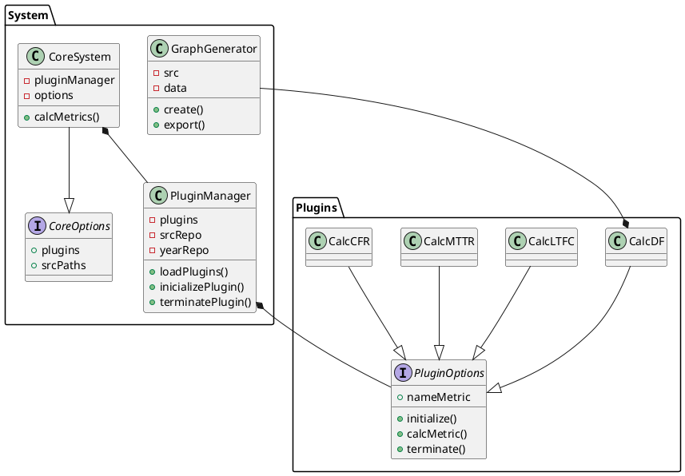

# Calculo metricas dora

## Explicacion del sistema

El sistema implementara un Kernel el cual se encargara de gestionar la conexion al repositorio a analizar y la especificacion del año que se estudiara. Ademas gestionara el uso de los plugins.

Los plugins/funciones seran los encargados de calcular las metricas del sistema y de generar una foto del grafico dentro de la carpeta especificada por el usuario

## Uso

### Instalacion

#### Depndencias del proyecto

```bash
npm install simple-git
```
#### Dependencias de desarrollo

```bash
npm install typescript --save-dev
npm install @types/node --save-dev
npm install nodemon --save-dev
```
### Ejecucion

```bash
npm run start
npm run dev -- ruta_del_repositorio_local/ carpeta_donde_guardar_grafico/ -df=true -ltfc=true -mttr=true -cfr=true
```
- En caso de no calcular alguna metrica cambie el true de esta por false.
- Recuerde reemplazar las rutas por las reales.
- 
## Diagrama de Clases

### Diagrama



### Explicacion Diagrama

- CoreSystem: es la clase encargada de iniciar el systema, obtener y configurar los parametros enviando los necesarios a PluginManager.
- PluginManager: el la clase encargada de cargar, inicializar y finalizar los plugins del sistema, dandoles a estos el src del repositorio objetivo y el año a analizar.
- Interfaz Plugin: define lo que todos los plugins deben implementar, como lo son su inicializacion, el calculo de su metrica especifica y el termino de esta.
- Interfaz CoreOptions: define las configuraciones necesarias para iniciar el CoreSystem.
- GraphGenerator: clase que construlle y exporta el grafico del calculo LTFC.
- CalcDF: es la clase que calcula Deployment Frecuency (DF).
- CalcLTFC: es la clase que calcula Lead Time for Changes (LTFC) y que ocupa GraphGenerator para crear un grafico con los resultados.
- CalcCFR: es la clase encargada de calcular Change Failure Rate (CFR).
- CalcMTTR: es la clase encargada de calcular Mean Time to Recovery (MTTR).
